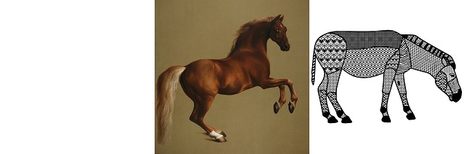

Video-Deep-Image-Analogy

====================================

By [@tomerbo](https://github.com/tomerbo), [@neta-ilan](https://github.com/neta-ilan) and [@ronfisher1111](https://github.com/ronfisher1111).

\---------------------------------------------------------------

This project is a python implementation for creating a styled video using Deep Image Analogy.

In this project, we extend the DIA technique proposed in Liao et al. 2017, to transfer the appearance of a single image to a short video, while maintaining the content of the video.
We focus on transferring the style of the image, to the video, while keeping the original structure of the video. By style, we address mainly the colors and textures of the image.

## Some results




## Requirements

 - python 3 (3.7)

 - opencv3

   If you use anaconda, you can install opencv3 by  ```conda install opencv```

 - pytorch

   See [pytorch](http://pytorch.org/) for installation

 - cuda (no CPU version implemention)
 
 - numpy
 
 - If you run debug mode then you also need: pandas and seaborn

## Usage

```bash
python main.py --video_path data/horse_frames --img_BP_path data/horse_1.jpg
```
- video_path for the path of the video's frames folder. The frames names should be of the from '#.jpg', starting with the name '0.jpg'.

- img_BP_path for the path of the style image.

More options and defaults:

```bash
--resize_ratio 0.5 --weight 2 --use_cuda True --LR 2 2 2 2 --debug False
```

 - Debug mode enables more detailed timers and loss plot.

## Acknowledgments

This project is part of the course Workshop in Machine Learning Applications for Computer Graphics, Under the supervision of Prof. Daniel Cohen-Or and Ron Mokady from Tel Aviv University.

Our project acknowledge the official code of [Deep Image Analogy](https://github.com/msracver/Deep-Image-Analogy), [Ben-Louis pytorch implementation](https://github.com/Ben-Louis/Deep-Image-Analogy-PyTorch), [harveyslash pytorch implementation](https://github.com/harveyslash/Deep-Image-Analogy-PyTorch) and [Kexiii](https://github.com/Kexiii/DeepImageAnalogy).
